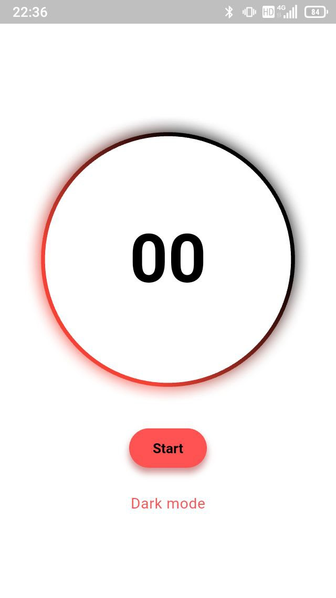

# orodomop

An app for __reverse pomodoro__: work until your're done with the task at hand, then take a break for 1/X of the time it took!

Written in Flutter for Android 5+ (hopefully).

| | | |
| --- | --- | --- |
|  |  |  |
|  |  |  |

## Features
- unstoppable: even if your phone dies, this app will keep counting
- light and dark mode
- customizable break duration
- Break-on-break, in case you ever feel like taking a break from the break.
