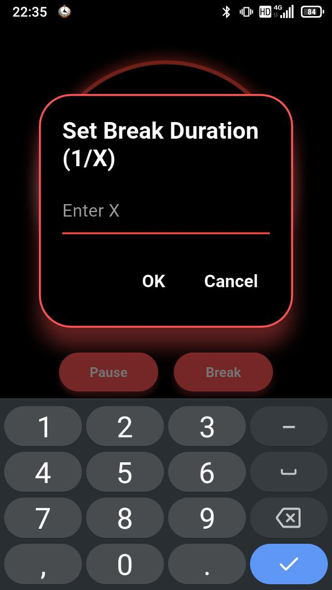

# orodomop

An app for __reverse__ (as well as regular) [__pomodoro__](https://en.wikipedia.org/wiki/Pomodoro_Technique): work until your're done with the task at hand, then take a break for 1/X of the time it took!

Written in Flutter for Android 5+.

| | | | | |
| --- | --- | --- | --- | --- |
|  |  |  |  | 
|  |  |  |  | 

## Features
- unstoppable: even if your phone dies, your progress won't be lost
- works both as a regular pomodoro timer and remit orodomop esrever a sa
- customizable pomodoro session duration, in case 25 minutes isn't even enough time to get started with the task
- customizable break duration, in case you want a slightly longer break this time
- break reminder, in case you never feel like taking a break
- break-on-break, in case you ever feel like taking a break from the break
- light and dark mode, for working day and night
- pleasant to use on 4-inch screens, because UX is not about who's got it bigger